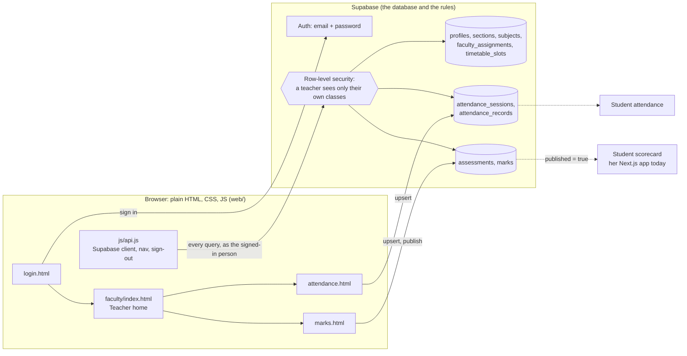

# How NEST works

```mermaid
flowchart LR
  subgraph Browser["Browser: plain HTML, CSS, JS (web/)"]
    L[login.html] --> H[faculty/index.html<br/>Teacher home]
    H --> A[attendance.html]
    H --> M[marks.html]
    API[js/api.js<br/>Supabase client, nav, sign-out]
  end
  subgraph Supabase["Supabase (the database and the rules)"]
    AU[Auth: email + password]
    RLS{{Row-level security:<br/>a teacher sees only their own classes}}
    T[(profiles, sections, subjects,<br/>faculty_assignments, timetable_slots)]
    AT[(attendance_sessions,<br/>attendance_records)]
    MK[(assessments, marks)]
  end
  L -- sign in --> AU
  API -- every query, as the signed-in person --> RLS
  RLS --> T & AT & MK
  A -- upsert --> AT
  M -- upsert, publish --> MK
  MK -. published = true .-> S[Student scorecard<br/>her Next.js app today]
  AT -.-> S2[Student attendance]
```

Pages marked in the picture live in `web/`. The student pages still come from
her Next.js app in `src/` until we port them. Both talk to the same database.
